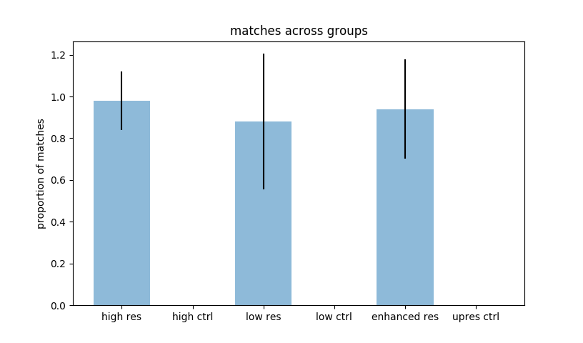

# Super Resolution Face Recognition

A program to recognize faces from low resolution images.

This was built using dlib's face recognition functionality,
a model with 99.38% accuracy on the Labeled Faces in the Wild benchmark,
and the super-resolution library Neural Enhance.


### Installation

To use, install numpy, scipy, dlib>=19.3.0, Click>=6.0,
 Pillow, face_recognition_models, Theano==0.8.2, git+https:<span></span>//github.com/Lasagne/Lasagne.git@61b1ad1#egg=Lasagne==0.2-dev


### Image Enhancement

To run the enhancement function through the terminal window, use:
```
$ python resface.py path/to/low/resolution/image
```
which will enhance and output the enhanced image at 2x resolution.

The pretained neural network, ne2x-photo-default-0.3.pkl.bz2, can be found at:
https://github.com/alexjc/neural-enhance/releases


##### Video Example


An example of low resolution image beside an enhanced, double resolution image.


### Face Recognition

To run the face recognition function through terminal window, use:

```
$ python resface.py path/to/ground/image zoom-factor subject name
$ python resface.py path/to/ground/image path/to/test/video subject-name
```

The first command will run a demo testing images against a ground training image.
The subject name must be more than one word.

The second command will run a demo video against a ground training image.

It will generate a video where all recognized faces are bound
by a red box, with the name of the subject if the face is recognized,
or question marks for an unknown person.

##### Example Images

Interestingly, preliminary results show that increases in resolution
can improve the face recognition capacity of the current algorithm.

When given a low resolution image, the pre-trained Face Recognition
library is unable to discern the face therein. However, when the
resolution is increased, the library can recognize the face,
as seen here.


<b>Low Res</b> A low resolution, unrecognized Bruce Springsteen.


<b>High Res</b> An image with enhanced resolution, which was recognized in dlib.


<b>Training Image</b> The training against which
the dlib recognition algorithm is trained.


### Preliminary results


Example data of multiple image comparisons across experimental groups.
High resolution, low resolution, and enhanced resolution of
desired subject, with false positive controls for each condition
with different subject were testing for threshold of face recognition.

The statistical testing script can be run with:

```
$ python statface.py
```

It outputs six matplotlib graphs to the interface.

Some examples are shown here:




<b>Example 1</b>
Comparisons between groups measuring rates of face recognition.


<b>Example 2</b>
Comparisons between groups where the low resolution group where the face
was recognized was removed.
