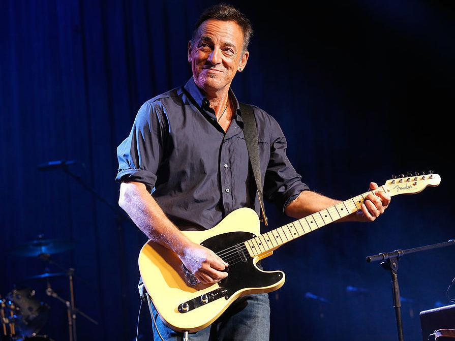

# Super Resolution Face Recognition

A program to recognize faces from low resolution images.

This was built using dlib's face recognition functionality,
a model with 99.38% accuracy on the Labeled Faces in the Wild benchmark,
and the super-resolution library Neural Enhance.

**Installation**

To use, install numpy, scipy, dlib>=19.3.0, Click>=6.0,
 Pillow, face_recognition_models, Theano==0.8.2, git+https://github.com/Lasagne/Lasagne.git@61b1ad1#egg=Lasagne==0.2-dev

### Uses

#### Face Recognition
To run the face recognition function through terminal window, use:

<i>$ python resface.py path/to/ground/image path/to/test/video subject-name</i>

which will display a video where all recognized faces are bound
by a green box, with the name of the subject if the face is recognized,
or an unknown person subtitle

#### Image Enhancement

To run the enhancement function through the terminal window, use:

<i>$ python resface.py path/to/low/resolution/image</i>

which will enhance and output the enhanced image at 2x resolution

### Preliminary results

Interestingly, preliminary results show that increases in resolution
can improve the face recognition capacity of the current algorithm.

When given a low resolution image, the pre-trained Face Recognition
library is unable to discern the face therein. However, when the
resolution is increased, the library can recognize the face,
as seen here.

The ground image against which the Face Recognition was trained.

The non-enhanced, low-resolution image.  The dlib face recognition
functionality was not able to recognize the subject.

An image enhanced with Neural Enhance.  The face was recognized
by dlib, as can be seen by the name output to it.

